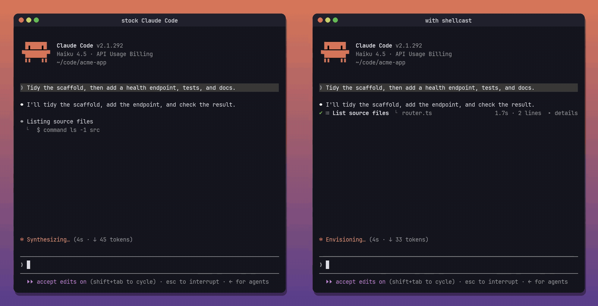

# shellcast

Live one-line rows for every shell command Claude runs, right in the Claude Code transcript. No side panel.

I got tired of my agent's shells being reduced to this:

<p align="center">
  
</p>

What is that shell doing? Is it stuck? How far along is it? shellcast puts every shell command Claude runs right in the transcript as a live row, and keeps long background jobs in sight while the agent goes on writing. Commands stay as one-line rows with their own icons, however long they run. Completed tool blocks collapse into a summary of the work and an icon strip, keeping the whole sequence easy to scan:

<p align="center">
  <strong>Stock Claude Code (left) · shellcast (right)</strong><br>
  <a href="assets/side-by-side.mp4"></a>
</p>

<p align="center"><sub>The same prompt, tool calls, file contents, and eight-second build, with synchronized scripted replies. A search, a file read, and nine shell commands collapse into descriptive blocks with their icons intact; three Write summaries stay compact. Icons use <code>SHELLCAST_ICONS=nerd-bold</code>.</sub></p>

<p align="center"><sub>Open the <a href="assets/side-by-side.mp4">full-size comparison</a>, individual <a href="assets/before.mp4">before</a> / <a href="assets/after.mp4">after</a> videos, or the <a href="assets/compact-writes.mp4">short icons + writes demo</a>.</sub></p>

Commands stay on one line from start to finish, with live output, reported progress and elapsed time while running. They never automatically expand into a card; use `▸ details` when you want more:

Compact command labels omit leading directory setup: `cd /long/worktree/path && npm test` shows as `npm test`. Descriptions stay intact, and details retain the full original command.

```
✔ ⚗ Run the test suite  ⎿ Tests  73 passed (73)              5.3s · 13 lines  ▸ details
✔ ⚙ Production build  ⎿ ✓ built in 4.61s                      5.3s · 6 lines  ▸ details
✘ $ Lint the codebase  ⎿ ✖ 2 problems (2 errors, 0 warnings)  exit 1 · 1.8s  ▸ details
```

## Install

In a Claude Code terminal session:

```
/plugin install shellcast --marketplace jeffarese/shellcast
```

Answer `y` to add the marketplace, then pick a scope (user scope loads it in every session). It starts working right away. No restart needed.

## What it shows

| State | Card |
| --- | --- |
| **Starting** | A quiet one-line row with a spinner. |
| **Running** | Always a compact row: spinner, title, latest output in fullscreen, reported progress, elapsed time and a timeout warning past half the limit. Long-running commands stay on one line too; command and output details open only when requested. |
| **Done** | A one-liner: `✔`, the description, the last line of output (the command, on the main screen), duration and line count. Chips appear for git commits, pushes and PRs, edited files, saved output, unsandboxed runs and timeouts. |
| **Completed block** | Consecutive successful tools collapse into a description such as `✔ Searched for 1 pattern, read 1 file, ran 7 shell commands`, followed by their icons and elapsed time when observed. Repeated icons get a count. Long summaries wrap to keep the description and icons visible. In fullscreen, `▸ details` restores the individual rows; each shell still has its own output toggle. Active blocks, failures, interruptions and pending results stay visible. |
| **Failed** | The same one-liner in red, with `✘` and the exit code. A call you declined shows as `⊘ not run`, not as a failure. |
| **Background** | A compact row stays above the prompt with the title, latest output, reported progress and elapsed time. At most three shells are shown, with an overflow count for the rest; there are no animated meters in these rows. The footer describes one shell and counts the others. At each main turn's end, the plugin reconciles its list with Claude Code's active tasks, removing stale rows even if a completion notice was missed. The transcript keeps each shell's details and final result; a missing exit status is shown as `finished · exit unknown`. Set `SHELLCAST_BACKGROUND=cards` before starting Claude Code to restore full pinned cards. |
| **Details** | In the fullscreen layout, `▸ details` on any card opens the full command, stdout and stderr, timing, task id and output file. |

On the terminal's main screen (not fullscreen), individual rows keep Claude Code's own `⎿` result block, and collapsed groups show a ctrl+o hint. Claude Code's expanded transcript and verbose mode retain every individual row. The desktop app, VS Code and mobile keep their native rows.

Successful `Write` calls in the terminal keep just the `Write(path)` header and `Wrote N lines to path` summary, without the source preview. Errors and writes awaiting owner review keep their native results.

### Command icons

A muted command icon sits between the status indicator and the title, including running, failed and background rows. Reading, listing, navigating, searching, editing, deleting, copying, moving, creating, Git, tests, builds and downloads each have their own icon.

Set `SHELLCAST_ICONS` before starting Claude Code:

| Value | Icons |
| --- | --- |
| `unicode` (default) | Plain symbols such as `▤` for reading, `≡` for listing and `↳` for navigation. |
| `nerd` | Set A: thin Codicons outlines. |
| `nerd-bold` | Set B: bolder Font Awesome symbols, with a Git logo and folder-plus icon. |
| `none` | Status indicators only. |

Both Nerd Font sets need a [Nerd Font](https://www.nerdfonts.com/) selected in your terminal; the **Nerd Font Mono** variant keeps the icon column one cell wide.

```sh
SHELLCAST_ICONS=nerd-bold claude
```

To keep the preference, add `export SHELLCAST_ICONS=nerd-bold` to your shell configuration, or set `env.SHELLCAST_ICONS` in `~/.claude/settings.json` for all Claude sessions. Use `nerd` to switch back to A. The font choice is explicit, rather than inferred from which fonts are installed.

Labels come from the command, not its description: `sed -n` gets a document and `sed -i` a pencil. Leading directory changes are skipped when another command follows (`cd project && npm test` gets a flask). Detection is best effort for shell scripts; unknown commands get a terminal icon. Icon selection never changes command execution.

## How live output works

Claude Code streams each shell's combined output to `<tmp>/claude-<uid>/<project>/<session>/tasks/b<id>.output`. A call claims the first such file that appears after it starts, and a 300 ms ticker reads it while the call runs: ANSI codes stripped, `\r` progress lines collapsed to their latest frame. shellcast only reads that folder. If it can't find it, cards still draw, just without the live tail.

## Develop

```
claude --plugin-dir /path/to/shellcast   # load from disk, reloads on save
claude plugin validate .                 # what the engine sees
claude plugin test .                     # tests/*.test.ts(x)
```

The demos are real Claude Code sessions in a throwaway sample project, recorded with a scripted stand-in for the model and simulated test/build output so both runs follow the same sequence. The file writes and shellcast rendering run normally.

Layout: `hooks/register.tsx` (the hooks), `hooks/card.tsx` (cards), `hooks/group.tsx` (collapsed tool blocks), `hooks/icons.ts` (command icons), `hooks/live.ts` (output tracking), `hooks/format.ts` (pure helpers), `types/index.d.ts` (the `$.state` contract).
