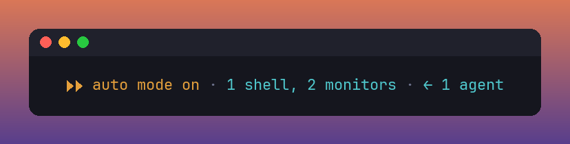
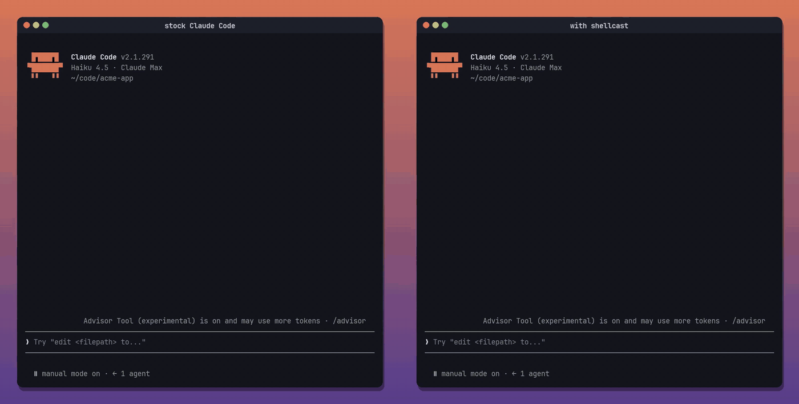

# shellcast

Live inline cards for every shell command Claude runs, right in the Claude Code transcript. No side panel.

I got tired of my agent's shells being reduced to this:

<p align="center">
  
</p>

What is that shell doing? Is it stuck? Did the build pass? shellcast puts every shell command Claude runs right in the transcript as a live card. Same prompt, same project:

<p align="center">
  
</p>

<p align="center"><sub>Left: stock Claude Code. Right: with shellcast. <a href="assets/demo.mp4">Full-quality MP4</a>.</sub></p>

While a command is running you can see its output, progress and throughput. Once it finishes, the card folds into a single line:

```
✔ Run the test suite  ⎿ Tests  73 passed (73)              5.3s · 13 lines  ▸ details
✔ Production build  ⎿ ✓ built in 4.61s                      5.3s · 6 lines  ▸ details
✘ Lint the codebase  ⎿ ✖ 2 problems (2 errors, 0 warnings)  exit 1 · 1.8s  ▸ details
```

## Install

In a Claude Code terminal session:

```
/plugin install shellcast --marketplace jeffarese/shellcast
```

Answer `y` to add the marketplace, then pick a scope (user scope loads it in every session). It starts working right away. No restart needed.

## What it shows

| State | Card |
| --- | --- |
| **Starting** | A quiet one-line row with a spinner. Commands that finish within about 1.5 s never open a card, so quick `ls` and `git status` calls don't flash. |
| **Running** | Framed card: spinner, elapsed time, syntax-highlighted command, the last 3 output lines as they stream, and a meter below them. The meter is a real progress bar when the output prints `45%` or `[3/10]`, and a shimmer otherwise. Under it: bytes, lines, a throughput sparkline, and a timeout warning past half the limit. |
| **Done** | A one-liner: `✔`, the description, the last line of output (the command, on the main screen), duration and line count. Chips appear for git commits, pushes and PRs, edited files, saved output, unsandboxed runs and timeouts. |
| **Failed** | The same one-liner in red, with `✘` and the exit code. A call you declined shows as `⊘ not run`, not as a failure. |
| **Background** | Dashed card that keeps streaming until the task's completion notice says how it ended (`✔ exit 0`, `✘ exit 1`, `■ stopped`). |
| **Details** | In the fullscreen layout, `▸ details` on any card opens the full command, stdout and stderr, timing, task id and output file. |

On the terminal's main screen (not fullscreen), finished rows keep Claude Code's own `⎿` result block, so ctrl+o still expands the output. The desktop app, VS Code and mobile keep their native rows. Shells that Claude Code would fold into "ran N shell commands" are unfolded so each gets its card.

## How live output works

Claude Code streams each shell's combined output to `<tmp>/claude-<uid>/<project>/<session>/tasks/b<id>.output`. A call claims the first such file that appears after it starts, and a 300 ms ticker reads it while the call runs: ANSI codes stripped, `\r` progress lines collapsed to their latest frame. shellcast only reads that folder. If it can't find it, cards still draw, just without the live tail.

## Develop

```
claude --plugin-dir /path/to/shellcast   # load from disk, reloads on save
claude plugin validate .                 # what the engine sees
claude plugin test .                     # tests/*.test.ts(x)
```

The demo was recorded from a real session against a throwaway sample project.

Layout: `hooks/register.tsx` (the hooks), `hooks/card.tsx` (drawing), `hooks/live.ts` (output tracking), `hooks/format.ts` (pure helpers), `types/index.d.ts` (the `$.state` contract).
